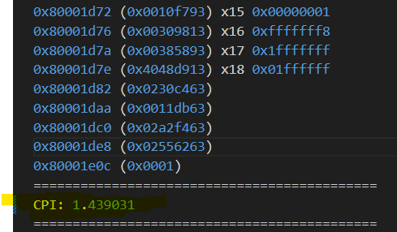

# Comparison of Single-Cycle, Pipelined, C-Extended, and Branch-Predicted Designs

## RV32I SINGLE-CYCLE CPU
### Timing - Usage Report

## RV32I 5-STAGE PIPELINED CPU
### Timing - Usage Report

## RV32I Single-Cycle vs. RV32I Pipelined

Both designs were synthesized for the same FPGA. The pipelined version achieved a **4.4× reduction in critical path delay**, directly improving the achievable clock frequency by the same factor. Consequently, overall performance increased by **4.4×**.

---

## Adding the C Extension (RV32IC)

The compressed instruction extension (C) was added to the pipelined RV32I design. Synthesis results showed **no degradation in critical path delay or performance**. 

### Timing - Usage Report

To evaluate code density, the same loop program (`loop.s`) was compiled using two compiler flags:

| ISA | Instruction Count | Instruction Width | Code Size |
|------|--------------------|------------------|------------|
| RV32I  | 75 | 4 bytes | 75 × 4 = **300 bytes** |
| RV32IC | 86 | 2 bytes | 86 × 2 = **172 bytes** |

**Code size reduction:**

\[
\text{Reduction} = \frac{300 - 172}{300} \times 100 = 42.7\%
\]

Thus, the C extension provides **approximately 42.7% reduction in code size** for this program.

---

## Adding Branch Prediction (RV32IC with Bimodal Predictor)

A bimodal branch predictor was integrated into the RV32IC pipelined processor.

### Timing - Usage Report

  

There was a  CPI improvement due to reduced control hazards.

| Program | CPI (No Predictor) | CPI (With Predictor) |
|----------|--------------------|----------------------|
| `full_test.s` | 1.419 | 1.145 |
| `loop.s` | 1.503 | 1.166 |

- full_test.s CPI Output:
 | 

- loop.s CPI Output:
 | 

---

## Performance Summary (for `full_test.s`)

The `full_test.s` program executes **14,736 instructions**. The table below summarizes the performance metrics for all four processor versions.

| Design | Critical Path Delay (ns) | CPI | Freq (MHz) | Execution Time (µs) |
|:--|:--:|:--:|:--:|:--:|
| **RV32I Single-Cycle** | 28.9 | 1.00 | 34.6 | (14,736 × 1) / 34.6 = **425.8 µs** |
| **RV32I Pipelined** | 6.5 | 1.44 | 153.8 | (14,736 × 1.44) / 153.8 = **137.9 µs** |
| **RV32IC Pipelined** | 6.5 | 1.44 | 153.8 | (14,736 × 1.44) / 153.8 = **137.9 µs** |
| **RV32IC Pipelined + Branch Prediction** | 6.0 | 1.145 | 166.6 | (14,736 × 1.145) / 166.6 = **101.2 µs** |

---

## Conclusion

The results demonstrate the progressive performance and efficiency improvements through architectural enhancements:

- **Pipelining** provides a **4.4× performance gain** due to shorter critical path delay.  
- **Compressed instructions (C extension)** reduce **reduce code size** with no performance penalty.  
- **Branch prediction** decreases CPI, improving execution efficiency without affecting maximum clock frequency.

---

## References
- Digital Design and Computer Architecture RISC-V Edition. David Harris, Sarah Harris
- David A. Patterson and John L. Hennessy “Computer Organization and Design RISC-V Edition: The Hardware Software Interface.” Morgan Kaufmann Publishers Inc., 2017, San Francisco, CA, USA
- The RISC-V Instruction Set Manual Volume I: Unprivileged ISA
- T. Kanamori and K. Kise, "RVCoreP-32IC: An optimized RISC- V soft processor supporting the compressed instructions," 2021 IEEE 14th International Symposium on Embedded Multicore/Many-core Systems-on-Chip (MCSoC), Singapore, Singapore, 2021, pp. 38-45, doi: 10.1109/MCSoC51149.2021.00014.
- 

